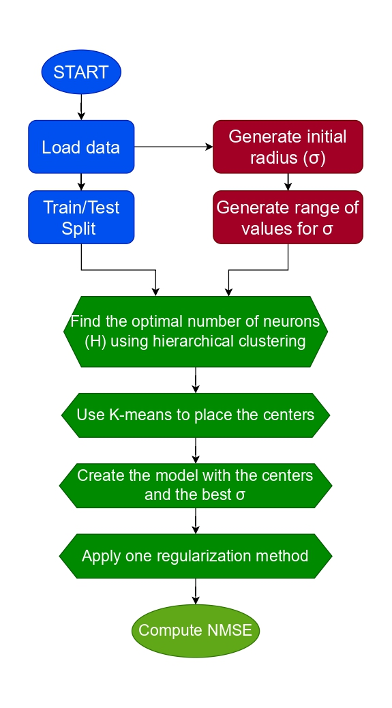

# 🧠 Entrenamiento de RBFNN con Clustering Jerárquico

Este repositorio presenta un nuevo método de entrenamiento para **Redes Neuronales de Función de Base Radial (RBFNN)** orientado a automatizar la selección del número de neuronas y mejorar la eficiencia computacional mediante regularización avanzada.

El objetivo principal es eliminar la elección arbitraria del número de neuronas y construir modelos precisos, estables y computacionalmente eficientes.

---

## ✅ Qué aporta este proyecto

- Selección automática del número de neuronas.
- Entrenamiento dividido en dos etapas bien diferenciadas:
  - Selección de neuronas.
  - Cálculo de pesos.
- Evaluación con datos sintéticos y reales.
- Comparativa frente al enfoque clásico basado en K-means.
- Buen comportamiento en escenarios de gran escala.
- Resultados competitivos usando hardware modesto.

---

## ⚙️ Flujo general del método

El proceso completo de entrenamiento sigue este flujo:

- Carga de los datos.
- División en conjuntos de entrenamiento y test.
- Inicialización y exploración de valores para el parámetro de suavizado (σ).
- Selección automática del número óptimo de neuronas mediante clustering jerárquico.
- Colocación de los centros usando K-means.
- Construcción del modelo final con los mejores hiperparámetros.
- Aplicación de regularización sobre los pesos.
- Evaluación del modelo mediante NMSE.

## 📊 Resultados

El método propuesto:

- Proporciona buenas estimaciones en tareas de regresión.
- Reduce el coste computacional frente a métodos más complejos.
- Mantiene un alto nivel de precisión.
- Escala razonablemente bien en grandes volúmenes de datos.

---

## 📄 Memoria completa del TFG

Puedes consultar el documento completo del trabajo aquí:

📘 **[Descargar memoria (PDF)](Memoria-mario.fernandez.simon.pdf)**

---

## 👤 Autor

**Mario Fernández Simón**  
Ingeniería Informática (Computación)

---
